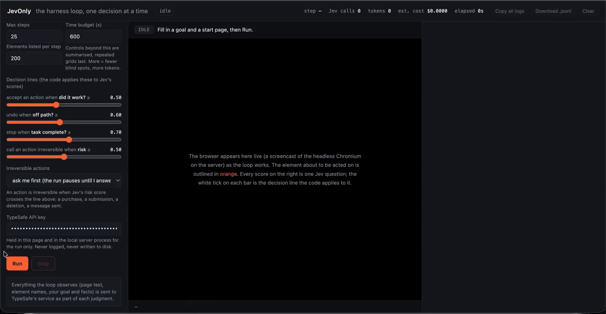
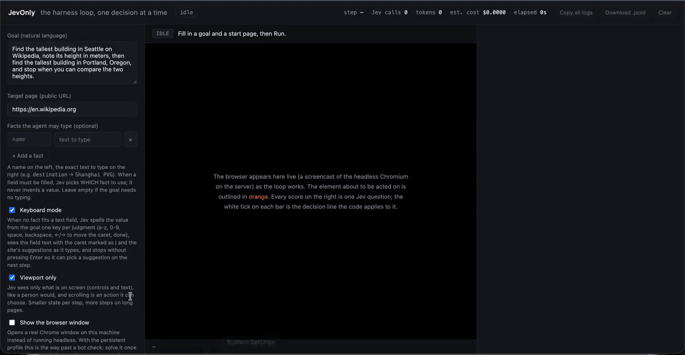

# JevOnly

**Pure Jev that can "type" and drive towards task completion.** No LLM anywhere: code builds every option from the page and the goal, [Jev](https://typesafe.ai) only picks — and that is enough to fill forms, type, and finish the task.





```bash
git clone https://github.com/buluoray/JevOnly.git && cd JevOnly && ./run.sh
```

Needs Python 3.12+, Node.js 22+ and a TypeSafe API key (`tsk_…`). `run.sh` creates a venv, installs
Chromium, and opens the live viewer at http://127.0.0.1:7791: paste the key, a start URL and a goal, press
**Run**, and watch every observation, vote, action, verification, copy and undo as it happens.

Without the viewer:

```bash
export TYPESAFE_API_KEY=tsk_…
jevonly run --start https://en.wikipedia.org \
  --goal "On Wikipedia, find the tallest building in Seattle and the tallest building in Portland, Oregon. Note the height in meters of each." \
  --variant noaccept_kb --out events.jsonl
```

That goal ends in about 20 steps, 80 Jev calls and 30 seconds with the answer `286; 166`.

## Demo

The recordings above, in full quality (click to play):

https://github.com/user-attachments/assets/4f21c5ab-c840-46dc-9337-0de8c4a16df6

https://github.com/user-attachments/assets/11ad01fc-4a23-4091-b3d6-d8129c88c694

## How it works

No planner model, no helper LLM, no free text. Every step is a closed question to Jev over options the
code enumerated from the page, the goal and a register of copied values:

1. **Observe** the page (accessibility snapshot of enabled controls and visible text).
2. **Vote**: one request answers _done?_, _off path?_ and _which action next?_
3. **Bind values**: a field can only receive a fact, a span of the goal (a name, a date, or a stretch of
   the goal's own words Jev narrows down to), or a value copied from the page — never invented text.
4. **Act and verify**: Chromium performs the action; Jev compares before and after. Failures are undone.
5. **Stop** when Jev says so, when every value the goal asked for is in hand, or when a code-owned check passes.

Irreversible actions (a risk vote ≥ 0.5) go through a gate: `refuse` (CLI default), `ask` (viewer default),
or `allow`. Details: [How it works](docs/how-it-works.md) · [Architecture](docs/architecture.md) ·
[Events](docs/events.md) · [FAQ](docs/faq.md).

The rules in `jevonly.core` are environment-agnostic; the browser (`jevonly.envs.browser`) is the first
environment. See [Writing an environment](docs/architecture.md#writing-an-environment).

## Safety and privacy

- The viewer binds to `127.0.0.1` only; the key stays in the tab's `sessionStorage` and the local process.
- The goal, facts and page observations are sent to TypeSafe. Point it at pages you are willing to send there.
- Nothing irreversible runs by default (see the gate above). Screenshots and replays never leave the machine.

## Limits

- English-centric goal splitting; sites that block automation are treated as walls, not bypassed.
- One run at a time per viewer; without a code-owned check, stopping is Jev's judgment.

## Development

```bash
make install && make test && make lint
```

Apache-2.0. Docs start at [`docs/README.md`](docs/README.md).
