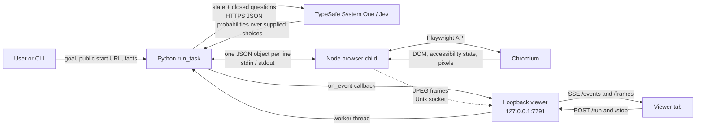

# Architecture

JevOnly is two layers. `jevonly.core` holds the rules -- closed choices, judge / act / verify / undo, the copy register, the stop conditions -- and knows nothing about browsers; it drives any object that implements `jevonly.core.Environment`. `jevonly.envs` holds the environments; the first is a real Chromium browser reached through a Node child. The optional viewer wraps the core in a loopback HTTP server and streams its events and frames to a browser tab.

## Components

| Component                                | Responsibility                                                                                                                                                                  |
| ---------------------------------------- | ------------------------------------------------------------------------------------------------------------------------------------------------------------------------------- |
| `jevonly.core.text`                      | Deterministic goal spans, goal clauses, page units, copy patterns, and balanced grouping.                                                                                       |
| `jevonly.core.questions`                 | Closed `choice` and probability (`noul`) question templates.                                                                                                                    |
| `jevonly.core.jev`                       | HTTPS client for `POST https://api.typesafe.ai/v1/systemone`; reads `TYPESAFE_API_KEY` for each call and records call metadata.                                                 |
| `jevonly.core.env`                       | The `Environment` protocol: `observe`, `act`, `undo`, `fingerprint`, `keyboard`, `inflight`, `wait_inflight`, `close`, plus the optional members the loop reads with `hasattr`. |
| `jevonly.envs`                           | Registry: `register(name, factory)` / `make(task)`; a task's `env` field (default `browser`) selects the environment.                                                           |
| `jevonly.envs.browser`                   | `BrowserEnv`; starts the Node child, translates snapshots to stable candidates, maintains undo state, and exposes act/observe/terminal operations.                              |
| `jevonly.core.keyboard`                  | Bounded goal-derived typing and autocomplete interaction.                                                                                                                       |
| `jevonly.core.copy`                      | Closed-choice narrowing from page units to one checked value.                                                                                                                   |
| `jevonly.core.loop`                      | `run_task`; owns planning, thresholds, history, retry, undo, risk, completion, and the event callback contract.                                                                 |
| `jevonly.cli`                            | `jevonly run` JSONL/compact output and `jevonly serve` dispatch.                                                                                                                |
| `jevonly.envs.browser.js.browser_server` | Node entry point for the one-command/one-response protocol.                                                                                                                     |
| `jevonly.envs.browser.js.snapshot`       | DOM and accessibility-oriented extraction of enabled controls and page text.                                                                                                    |
| `jevonly.envs.browser.js.actions`        | Playwright actions, settle tracking, tabs, screenshots, keyboard, and screencast transport.                                                                                     |
| `jevonly.viewer.server`                  | Loopback HTTP server, one worker thread per active run, event replay, SSE, and static assets.                                                                                   |
| `jevonly.viewer.static`                  | Form, live Chromium stage, decision timeline, compact/JSONL exports, replay, and local GIF encoding.                                                                            |

## Process and data flow



## Python-to-Node protocol

`BrowserEnv` resolves the packaged `js/browser_server.js` with `importlib.resources` and starts it as a child process. The API key is removed from the child's environment. Standard input and output carry a strict request/reply stream:

```text
Python -> Node: {"cmd":"snapshot","max_cands":200,"text_budget":6000,...}\n
Node   -> Python: {"ok":true,"snapshot":{...}}\n
```

Each line is one complete JSON object. Each request receives one response before the next request. Diagnostics use standard error rather than the protocol stream. Candidate indices are valid only for the latest snapshot; Python also computes stable ids from role, name, context, and duplicate occurrence so rejection and fact-use memory survive ordinary DOM reordering.

See [Browser child protocol](browser-protocol.md) for every command and field.

## Observation and action path

1. Node finds visible, enabled interactive elements and extracts role, name, context, value, options, state, and modal scope.
2. Python converts those elements into candidates with stable ids and action kinds.
3. Python adds local pseudo-actions such as copy, scroll, and find.
4. `run_task` sends the state and closed questions to Jev.
5. Python resolves the winning supplied id and sends its indexed action to Node.
6. Node applies the action through Playwright and replies at once; the loop observes immediately and waits for action-triggered requests only when a verification fails while they are still in flight (or before an irreversible action).
7. Python observes again, asks Jev to verify the intended effect and progress, then accepts, retries, undoes, or escalates.

## Viewer execution model

| Concern      | Design                                                                                                                                             |
| ------------ | -------------------------------------------------------------------------------------------------------------------------------------------------- |
| Binding      | `QuietServer` binds to `127.0.0.1`; the viewer is not exposed on other interfaces.                                                                 |
| Concurrency  | A single global `Run` accepts one active run. A second `POST /run` receives HTTP `409`.                                                            |
| Worker       | `POST /run` starts one daemon thread that calls `run_task`.                                                                                        |
| Event stream | `on_event` appends sequenced records; `/events` replays records after `since` and then waits on a condition variable.                              |
| Jev stream   | `jevonly.core.jev.ON_JEV` adds a `jev` viewer event with questions, answers, trimmed state, latency, tokens, retries, and estimated cost.          |
| Frame stream | Node sends JPEG screencast frames to a process-specific, permission-`0600` Unix socket; `/frames` forwards only the latest frame over SSE.         |
| Replay       | The tab records live frames in memory, falling back to decision-point screenshots after reload.                                                    |
| Export       | Compact text, JSONL, and GIF are built in the tab; screenshots are redacted from compact text and represented as omitted markers in JSONL records. |
| Shutdown     | The worker emits `end`; the viewer adds `closed` after restoring environment state and closing Jev transport.                                      |

## Extension seams

| Seam                        | Contract                                                                                                                             |
| --------------------------- | ------------------------------------------------------------------------------------------------------------------------------------ |
| Library execution           | `run_task(task, variant="std", rep=0, on_event=None, stop=None)`                                                                     |
| Event consumer              | `on_event(kind, payload)`; see [Events](events.md). Exceptions from the callback are suppressed so observability cannot break a run. |
| Cooperative stop            | `stop()` returns truthy; checked before observations and actions.                                                                    |
| Runtime credential rotation | Set a new `TYPESAFE_API_KEY`; `jev()` reads it at the next call.                                                                     |
| Browser executable          | `JEVONLY_NODE` selects Node; `JEV_PLAYWRIGHT` selects a Playwright module or directory.                                              |

## Writing an environment

An environment is anything that can show its state as a list of candidates and perform one of them.
Implement `jevonly.core.Environment` (see `src/jevonly/core/env.py` for the contract and the optional
members), register a factory, and give tasks `"env": "<name>"`:

```python
from jevonly import envs, run_task


class FileSystemEnv:
    def __init__(self, task): ...
    def observe(self): ...  # {"url": cwd, "title": ..., "elements": [...candidates...], "visible_text": ...}
    def act(self, cand, value=None, kind=None): ...
    def undo(self): ...
    def fingerprint(self, obs): ...
    def keyboard(self, cand=None, key=None, text=None, focus=False): ...
    def inflight(self):
        return 0

    def wait_inflight(self, cap_ms=3000):
        return 0

    def close(self): ...


envs.register("fs", FileSystemEnv)
run_task({"id": "demo", "env": "fs", "goal": "...", "start": "/tmp/project", "facts": {}, "faults": []})
```

Each candidate is a dict with at least `id`, `kind` (`click` / `fill` / `select` / `check` / `scroll` /
`find`), `desc` (what Jev reads), `role`, `name` and optional `context` / `value` / `options`. The
core never inspects the environment's internals beyond this contract; the browser environment is the
worked example.
